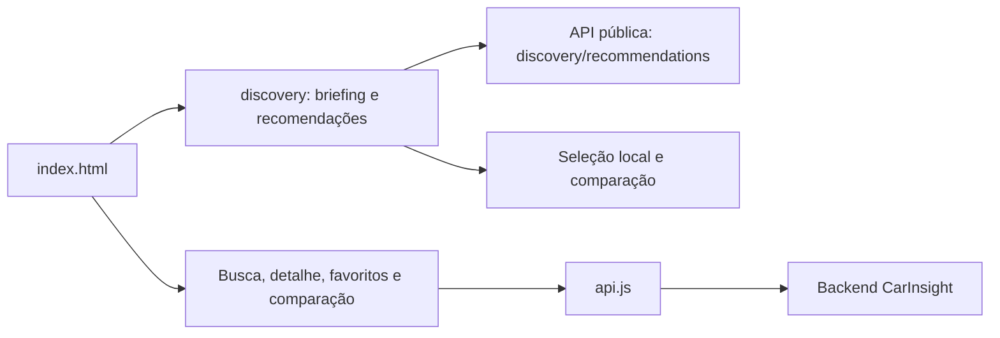

# CarInsight

Descoberta de veículos a partir de preferências, com razões verificáveis, comparação e contato escolhido pelo comprador. Mantém a identidade e as páginas estáticas existentes.

## Rodar e verificar

Use Node 22.23.2 (`.nvmrc`). Execute `npm run setup`, `npm start` e abra `http://localhost:8080`. O setup instala o lock e o Chromium e pode ser repetido. Em Linux sem bibliotecas de browser, execute `npx playwright install-deps chromium` uma vez.

Execute `npm run verify` para formatação, checkJs, testes de contrato e E2E. As APIs são mockadas nos testes, sem credenciais e sem contato com vendedores. A CI executa o mesmo gate. `npm run format` limita mudanças ao código novo para preservar o legado.

## Arquitetura

`assets/` contém a identidade existente; `style.css` atende o legado. `discovery/` contém módulos novos, com JSDoc e checkJs. `tests/` contém o funil E2E e cenários da descoberta. `tests-unit/` verifica contratos puros.

## Origem da API

Localhost/127.0.0.1 usam `http://localhost:3000`. Outros domínios usam `https://backend-production-8159.up.railway.app`, reconciliando o código com a origem observada no deploy. Configure outra origem por `<meta name="carinsight-api-origin" content="https://api.example.com">`; `/api` exige um proxy HTTP real no servidor.

Veículos só aparecem a partir do inventário retornado. Orçamento e critérios ajudam a ordenar; fotos, laudo, histórico, localização e disponibilidade devem ser confirmados quando não informados. Nenhuma preferência é aprovação de financiamento.
