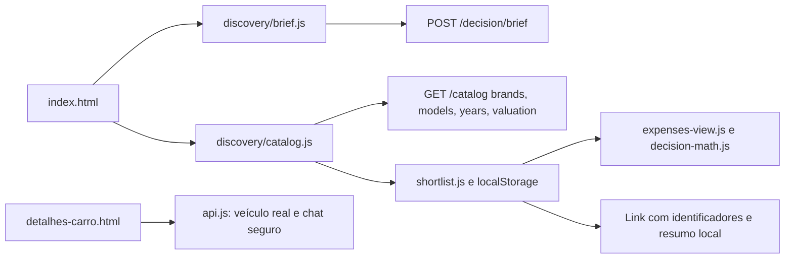

# CarInsight

Assistente de decisão de compra: briefing, catálogo de modelos e anos, referência FIPE com fonte, comparação de até três opções e despesas informadas pelo comprador. Não exige concessionárias cadastradas e não apresenta referências como anúncios.

## Rodar e verificar

Use Node 22.23.2 (`.nvmrc`). Execute `npm run setup`, depois `npm start`, e abra `http://localhost:8080`. O setup instala o lock, prepara Chromium e gera `dist/`; pode ser repetido. Linux sem bibliotecas do browser precisa de `npx playwright install-deps chromium`.

`npm run verify` executa formatação, checkJs, testes unitários, build e E2E do produto em `dist/`. APIs são mockadas nos testes, sem credenciais ou contato com vendedores. `npm test` também gera o build antes dos E2E. A CI usa o mesmo gate. `npm run format` formata a jornada nova e seus testes; o legado mantém a formatação existente.

O hook `.githooks/pre-commit` verifica formatação, tipos e unitários. Para habilitá-lo neste clone: `git config core.hooksPath .githooks`. O gate completo continua obrigatório antes de publicar.

## Arquitetura

`assets/` preserva a identidade. `discovery/` contém módulos JS com JSDoc/checkJs e CSS separado por responsabilidade. Todo conteúdo retornado pelo catálogo é renderizado com DOM/textContent. Mudanças de marca, modelo ou ano invalidam respostas pendentes. Orçamento manual nunca é substituído por uma interpretação atrasada.

O briefing usa `/decision/brief` com `naturalLanguage` e `constraints.budgetMax` quando digitado. O backend é a única fonte de interpretação do texto. `interpretation: rules` é exibido como análise por critérios; `llm` é identificado como apoio de IA. Falha do assistente não bloqueia o catálogo.

## Contrato do catálogo

- `GET /catalog/brands` retorna marcas.
- `GET /catalog/models?brandId=...` retorna modelos/versões.
- `GET /catalog/years?brandId=...&modelId=...` retorna anos/combustíveis.
- `GET /catalog/valuation?brandId=...&modelId=...&yearId=...` retorna referência de preço, código FIPE, mês, fonte e data de consulta.

Listas usam `{items:[{code,name}],source,retrievedAt,cached}`. Referências usam `kind: reference_valuation`, `brand`, `model`, `modelYear`, `fuel`, `codeFipe`, `price`, `referenceMonth`, `source`, `retrievedAt`. Parallelum é um provedor independente. Valor de referência não é oferta, disponibilidade, preço garantido ou veículo inspecionado.

## Publicação e configuração

`npm run build` publica uma lista explícita de arquivos em `dist/`. A raiz serve o produto. Arquivos de desenvolvimento e protótipos do marketplace ficam fora de `dist/`; URLs antigas de busca/salvos/comparação/venda redirecionam para as seções equivalentes do consultor. A página de detalhe permanece disponível apenas para IDs reais retornados pela API, com estados de erro e ausência.

Defina `CARINSIGHT_API_ORIGIN` no build para uma origem HTTPS pública. O build gera `runtime-config.js`, sem segredos, carregado antes das APIs em home e detalhe. `/api` também é aceito, mas exige proxy real no servidor. Sem configuração, localhost/127.0.0.1 usam `http://localhost:3000`; demais domínios usam `https://backend-production-8159.up.railway.app`.

`Dockerfile` usa Node 22 e serve somente `dist/` na porta 8080. `npm start` pressupõe build concluído. O deploy deve disponibilizar os endpoints novos antes do frontend. Não publicar credenciais no cliente.

## Escopo e privacidade

O briefing é enviado ao backend para interpretar preferências. Plano e referências ficam no navegador. O link de comparação contém somente IDs de marca/modelo/ano; os valores são consultados novamente na API. Orçamento, cidade, texto e despesas não vão nesse link. Baixar resumo gera um arquivo local por ação explícita.

Custos mensais usam distância, consumo, combustível e despesas anuais inseridos pelo usuário. Campos vazios continuam desconhecidos; zero precisa ser explícito. O subtotal é parcial: não inclui depreciação, financiamento ou custos fora dos campos. Elétricos não usam a conta de combustível por litro. Comparar referências não confirma consumo, segurança, estado ou histórico de um carro específico.

Fontes técnicas em `docs/implementation-sources.md`. Capturas em `docs/visual/`; cenários com marca/modelo de teste são fixtures de QA, nunca publicados em `dist/`.
